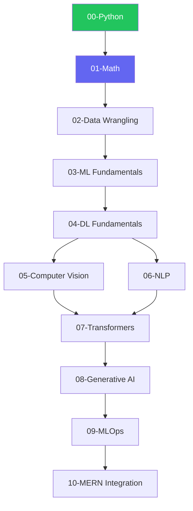

# 🤖 Om Learns AI

### Zero to Hero in AI & Machine Learning

> A comprehensive, structured journey from complete beginner to AI practitioner.
> 
> *Open-source • Self-paced • Project-based • Interview-ready*


---

## 📈 Progress


```
🌱 FOUNDATIONS        ████████████████████ 100%  ✅
📐 MATHEMATICS        ░░░░░░░░░░░░░░░░░░░░   0%  🔜
📊 DATA WRANGLING     ░░░░░░░░░░░░░░░░░░░░   0%  
🤖 ML FUNDAMENTALS    ░░░░░░░░░░░░░░░░░░░░   0%  
🧠 DEEP LEARNING      ░░░░░░░░░░░░░░░░░░░░   0%  
👁️ COMPUTER VISION    ░░░░░░░░░░░░░░░░░░░░   0%  
📝 NLP                ░░░░░░░░░░░░░░░░░░░░   0%  
🤖 TRANSFORMERS       ░░░░░░░░░░░░░░░░░░░░   0%  
✨ GENERATIVE AI      ░░░░░░░░░░░░░░░░░░░░   0%  
🚀 MLOPS              ░░░░░░░░░░░░░░░░░░░░   0%  
```

---

## 🎯 What is This?

**Om Learns AI** is my personal journey to master AI/ML from scratch — and a **beginner-friendly guide** anyone can follow.

**Why this repo?**
- 😵 Scattered resources → 📚 Everything in one place
- 🤔 Don't know where to start → 🗺️ Day-by-day roadmap
- 📖 Theory without practice → 💻 Hands-on code
- 🎓 Gap between learning & jobs → 💼 Interview prep + real projects

---

## 🚀 Learning Path

Each branch is self-contained with its own README and curriculum.

### 🌱 Foundation

| Module | Branch | Status |
|--------|--------|--------|
| Python Foundations | [`00-python-foundations`](https://github.com/omunite215/Om-Learns-AI/tree/00-python-foundations) | ✅ Done |
| Mathematics for ML | `01-mathematics` | 🔜 Next |
| Data Wrangling | `02-data-wrangling` | 🔜 Soon |

### 🤖 Machine Learning

| Module | Branch | Status |
|--------|--------|--------|
| ML Fundamentals | `03-ml-fundamentals` | 📅 Planned |
| Supervised Learning | `03a-supervised-learning` | 📅 Planned |
| Unsupervised Learning | `03b-unsupervised-learning` | 📅 Planned |
| Model Evaluation | `03c-model-evaluation` | 📅 Planned |

### 🧠 Deep Learning

| Module | Branch | Status |
|--------|--------|--------|
| DL Fundamentals | `04-deep-learning-fundamentals` | 📅 Planned |
| Computer Vision | `05-computer-vision` | 📅 Planned |
| NLP Fundamentals | `06-nlp-fundamentals` | 📅 Planned |

### 🚀 Advanced AI

| Module | Branch | Status |
|--------|--------|--------|
| Transformers & LLMs | `07-transformers-llms` | 📅 Planned |
| Generative AI | `08-generative-ai` | 📅 Planned |

### 🛠️ Production

| Module | Branch | Status |
|--------|--------|--------|
| MLOps | `09-mlops` | 📅 Planned |
| MERN + ML Integration | `10-mern-integration` | 📅 Planned |

### 📚 Extras

| Module | Branch | Status |
|--------|--------|--------|
| Research Papers | `research-papers` | 📅 Planned |
| Interview Prep | `interview-prep` | 📅 Planned |
| Projects Hub | `projects` | 📅 Planned |

---

## ✅ Completed

<details>
<summary><b>00-Python-Foundations</b> — 20 Days</summary>

**Week 1:** Strings, Numbers, Collections, Modules, Slicing, Sorting

**Week 2:** String Formatting, Conditionals, OS, DateTime, Files, Errors, Generators

**Week 3:** OOP, Classes, Inheritance, Special Methods, JSON, APIs, Iterators

🔗 [Go to branch →](https://github.com/omunite215/Om-Learns-AI/tree/00-python-foundations)

</details>

---

## 🗺️ Roadmap



---

## 💡 Philosophy

**Learn → Code → Build**

1. 📚 **Learn** — Read theory, understand concepts
2. 💻 **Code** — Type every example, experiment
3. 🏗️ **Build** — Create projects, solve real problems

### Quick Start

```bash
# Clone the repo
git clone https://github.com/omunite215/Om-Learns-AI.git
cd Om-Learns-AI

# Switch to a learning branch
git checkout 00-python-foundations

# Follow the branch README
```

### Learning Pace

| Pace | Time/Day | Duration |
|------|----------|----------|
| 🐢 Relaxed | 1-2 hrs | ~12 months |
| 🚶 Steady | 2-3 hrs | ~6 months |
| 🏃 Intensive | 4-6 hrs | ~3 months |

---

## 🛠️ Tech Stack

**Languages:** Python

**Libraries:** NumPy, Pandas, Scikit-learn, PyTorch, TensorFlow

**Tools:** Jupyter, VS Code, Git, Docker, HuggingFace

---

## 📁 Structure

```
Om-Learns-AI/
├── main                    # 👈 You are here
├── 00-python-foundations   # ✅ Complete
├── 01-mathematics          # 🔜 Coming soon
├── 02-data-wrangling
├── 03-ml-fundamentals
├── 04-deep-learning-fundamentals
├── 05-computer-vision
├── 06-nlp-fundamentals
├── 07-transformers-llms
├── 08-generative-ai
├── 09-mlops
├── 10-mern-integration
├── research-papers
├── interview-prep
└── projects/
```

---

## 🎯 Upcoming Projects

| Project | Tech | Status |
|---------|------|--------|
| Sentiment Analyzer | NLP, BERT, Flask | 📅 |
| Image Classifier | CNN, PyTorch | 📅 |
| RAG Chatbot | LangChain, OpenAI | 📅 |
| ML Dashboard | Pandas, Plotly | 📅 |

---

## 🤝 Contributing

- 🐛 Found a bug? Open an issue
- 💡 Suggestion? Start a discussion
- ⭐ Find this useful? Star the repo!

---

## 📬 Connect

[](https://www.linkedin.com/in/om-patel-401068143/)
[](https://github.com/omunite215)
[](https://omthecreator.netlify.app/)

---

## 📄 License

MIT License — see [LICENSE](LICENSE) for details.

---

**"The journey of a thousand miles begins with a single step."** — Lao Tzu

Made with ❤️ by [Om Patel](https://github.com/omunite215)
