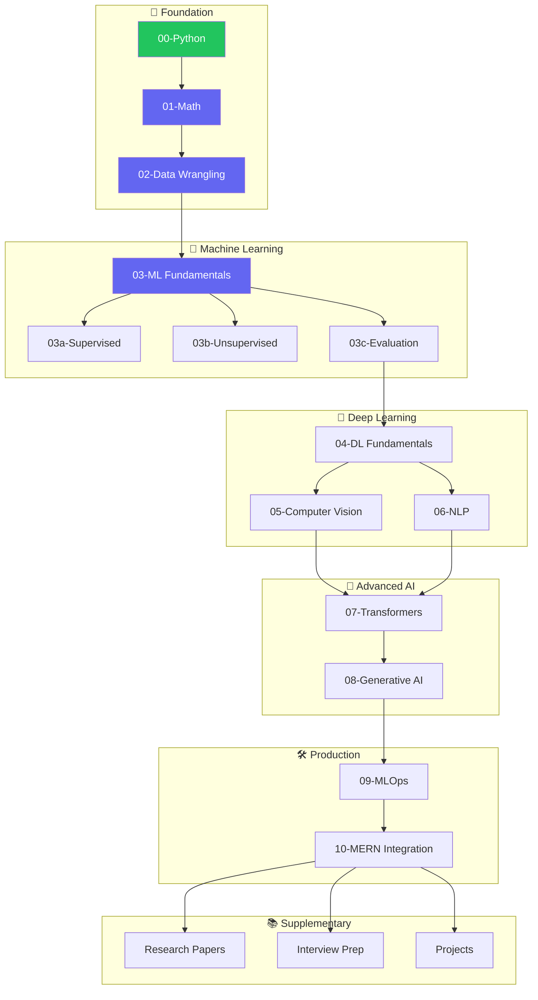

# 🤖 Om Learns AI

<div align="center">


<br/>


<br/>

**A comprehensive, structured journey from complete beginner to AI practitioner**

*Open-source • Self-paced • Project-based • Interview-ready*

[🚀 Start Learning](#-learning-path) •
[📊 Progress](#-current-progress) •
[🗺️ Roadmap](#-complete-roadmap) •
[💡 Philosophy](#-learning-philosophy)

---

### 📈 Overall Progress


**1 of 20 modules completed**

</div>

---

## 🎯 What is This?

**Om Learns AI** is my personal journey to master Artificial Intelligence and Machine Learning from absolute scratch. But it's more than just my notes — it's a **comprehensive, beginner-friendly guide** that anyone can follow.

### Why This Repository?

| Problem | Solution |
|---------|----------|
| 😵 Scattered resources everywhere | 📚 Everything in one structured place |
| 🤔 Don't know where to start | 🗺️ Clear day-by-day roadmap |
| 📖 Theory without practice | 💻 Hands-on code in every module |
| 🎓 Gap between learning and jobs | 💼 Interview prep & real projects |

---

## ✨ Features

<table>
<tr>
<td width="50%">

### 📖 Learning Modules
- Structured branch-based curriculum
- Day-by-day commit history to follow
- Comprehensive code comments
- Practice exercises with solutions

</td>
<td width="50%">

### 💼 Career Ready
- Interview preparation materials
- System design for ML
- Real-world projects
- MLOps & deployment skills

</td>
</tr>
<tr>
<td width="50%">

### 🔬 Research Focused
- Paper summaries & implementations
- State-of-the-art techniques
- Mathematical foundations
- From theory to practice

</td>
<td width="50%">

### 🛠️ Production Skills
- Full-stack ML integration
- Docker & containerization
- CI/CD pipelines
- Cloud deployment

</td>
</tr>
</table>

---

## 🚀 Learning Path

Navigate to any branch to start learning. Each branch is self-contained with its own README and structured curriculum.

### 🌱 Foundation Layer

| Module | Branch | Status | Description |
|--------|--------|--------|-------------|
| **Python Foundations** | [`00-python-foundations`](https://github.com/omunite215/Om-Learns-AI/tree/00-python-foundations) | ✅ Complete | Python basics, OOP, file handling, advanced concepts |
| **Mathematics for ML** | `01-mathematics` | 🔜 Coming Soon | Linear algebra, calculus, probability, statistics |
| **Data Wrangling** | `02-data-wrangling` | 🔜 Coming Soon | NumPy, Pandas, Matplotlib, Seaborn, data cleaning |

### 🤖 Machine Learning Layer

| Module | Branch | Status | Description |
|--------|--------|--------|-------------|
| **ML Fundamentals** | `03-ml-fundamentals` | 📅 Planned | Supervised & unsupervised learning, model evaluation |
| ↳ Supervised Learning | `03a-supervised-learning` | 📅 Planned | Regression, classification, ensemble methods |
| ↳ Unsupervised Learning | `03b-unsupervised-learning` | 📅 Planned | Clustering, dimensionality reduction |
| ↳ Model Evaluation | `03c-model-evaluation` | 📅 Planned | Metrics, cross-validation, hyperparameter tuning |

### 🧠 Deep Learning Layer

| Module | Branch | Status | Description |
|--------|--------|--------|-------------|
| **DL Fundamentals** | `04-deep-learning-fundamentals` | 📅 Planned | Neural networks, PyTorch, TensorFlow |
| **Computer Vision** | `05-computer-vision` | 📅 Planned | CNNs, object detection, image segmentation |
| **NLP Fundamentals** | `06-nlp-fundamentals` | 📅 Planned | Text processing, embeddings, RNN/LSTM |

### 🚀 Advanced AI Layer

| Module | Branch | Status | Description |
|--------|--------|--------|-------------|
| **Transformers & LLMs** | `07-transformers-llms` | 📅 Planned | Attention mechanism, BERT, GPT, fine-tuning |
| **Generative AI** | `08-generative-ai` | 📅 Planned | RAG, LangChain, AI agents, prompt engineering |

### 🛠️ Production Layer

| Module | Branch | Status | Description |
|--------|--------|--------|-------------|
| **MLOps** | `09-mlops` | 📅 Planned | Deployment, Docker, CI/CD, monitoring |
| **MERN + ML Integration** | `10-mern-integration` | 📅 Planned | Full-stack ML apps, API design |

### 📚 Supplementary Materials

| Module | Branch | Status | Description |
|--------|--------|--------|-------------|
| **Research Papers** | `research-papers` | 📅 Planned | Paper summaries & implementations |
| **Interview Prep** | `interview-prep` | 📅 Planned | ML questions, system design, coding |
| **Projects Hub** | `projects` | 📅 Planned | End-to-end ML projects |

---

## 📊 Current Progress

<div align="center">

```
🌱 FOUNDATIONS        ████████████████████ 100%  ✅ Complete!
📐 MATHEMATICS        ░░░░░░░░░░░░░░░░░░░░   0%  🔜 Next
📊 DATA WRANGLING     ░░░░░░░░░░░░░░░░░░░░   0%  
🤖 ML FUNDAMENTALS    ░░░░░░░░░░░░░░░░░░░░   0%  
🧠 DEEP LEARNING      ░░░░░░░░░░░░░░░░░░░░   0%  
👁️ COMPUTER VISION    ░░░░░░░░░░░░░░░░░░░░   0%  
📝 NLP                ░░░░░░░░░░░░░░░░░░░░   0%  
🤖 TRANSFORMERS       ░░░░░░░░░░░░░░░░░░░░   0%  
✨ GENERATIVE AI      ░░░░░░░░░░░░░░░░░░░░   0%  
🚀 MLOPS              ░░░░░░░░░░░░░░░░░░░░   0%  
```

</div>

### ✅ Completed Modules

<details>
<summary><b>00-Python-Foundations</b> — 20 Days • Click to expand</summary>

<br/>

| Week | Days | Topics Covered |
|------|------|----------------|
| **Week 1** | Day 1-7 | Strings, Numbers, Collections, Modules, Slicing, Sorting |
| **Week 2** | Day 8-14 | String Formatting, Conditionals, OS, DateTime, Files, Errors, Generators |
| **Week 3** | Day 15-20 | OOP, Classes, Inheritance, Special Methods, JSON, APIs, Iterators |

**🔗 [Go to Python Foundations →](https://github.com/omunite215/Om-Learns-AI/tree/00-python-foundations)**

</details>

---

## 🗺️ Complete Roadmap



---

## 💡 Learning Philosophy

### 🎯 The Three Pillars

<table>
<tr>
<td align="center" width="33%">

### 📚 Learn
Read theory, understand concepts, follow tutorials

</td>
<td align="center" width="33%">

### 💻 Code
Type every example, do exercises, experiment

</td>
<td align="center" width="33%">

### 🏗️ Build
Create projects, solve real problems, deploy

</td>
</tr>
</table>

### 📖 How to Use This Repository

```bash
# 1. Clone the repository
git clone https://github.com/omunite215/Om-Learns-AI.git
cd Om-Learns-AI

# 2. Switch to any learning branch
git checkout 00-python-foundations

# 3. Follow the branch's README for day-by-day instructions

# 4. Track your progress using git log
git log --oneline
# Day 20: Iterators & Iterables ✅
# Day 19: JSON & APIs ✅
# ...
```

### 📅 Suggested Learning Schedule

| Your Pace | Daily Commitment | Time to Complete |
|-----------|------------------|------------------|
| 🐢 Relaxed | 1-2 hours/day | ~12 months |
| 🚶 Steady | 2-3 hours/day | ~6 months |
| 🏃 Intensive | 4-6 hours/day | ~3 months |

---

## 🛠️ Tech Stack Used

<div align="center">

### Languages & Libraries


### Tools & Platforms


</div>

---

## 📁 Repository Structure

```
Om-Learns-AI/
│
├── main                          # 👈 You are here! Overview & navigation
│
├── 🌱 FOUNDATION
│   ├── 00-python-foundations     # ✅ Python basics → Advanced
│   ├── 01-mathematics            # 🔜 Linear algebra, calculus, stats
│   └── 02-data-wrangling         # 🔜 NumPy, Pandas, visualization
│
├── 🤖 MACHINE LEARNING
│   ├── 03-ml-fundamentals        # Core ML concepts
│   ├── 03a-supervised-learning   # Regression, classification
│   ├── 03b-unsupervised-learning # Clustering, dim. reduction
│   └── 03c-model-evaluation      # Metrics, validation
│
├── 🧠 DEEP LEARNING
│   ├── 04-deep-learning-fundamentals
│   ├── 05-computer-vision
│   └── 06-nlp-fundamentals
│
├── 🚀 ADVANCED AI
│   ├── 07-transformers-llms
│   └── 08-generative-ai
│
├── 🛠️ PRODUCTION
│   ├── 09-mlops
│   └── 10-mern-integration
│
├── 📚 SUPPLEMENTARY
│   ├── research-papers
│   ├── interview-prep
│   └── projects/
│       ├── project-sentiment-analyzer
│       ├── project-image-classifier
│       └── project-rag-chatbot
│
└── README.md
```

---

## 🎯 Projects Showcase

*Coming Soon — Projects will be added as modules are completed*

| Project | Technologies | Module | Status |
|---------|--------------|--------|--------|
| Sentiment Analyzer | NLP, BERT, Flask | 06-NLP | 📅 Planned |
| Image Classifier | CNN, PyTorch, Streamlit | 05-CV | 📅 Planned |
| RAG Chatbot | LangChain, OpenAI, Vector DB | 08-GenAI | 📅 Planned |
| ML Dashboard | Pandas, Plotly, Dash | 02-Data | 📅 Planned |

---

## 🤝 Contributing

This is primarily my learning journey, but contributions are welcome!

- 🐛 **Found a bug?** Open an issue
- 💡 **Have a suggestion?** Start a discussion
- 📝 **Want to improve docs?** Submit a PR
- ⭐ **Find this useful?** Star the repository!

---

## 📬 Connect With Me

<div align="center">

[](https://www.linkedin.com/in/om-patel-401068143/)
[](https://github.com/omunite215)
[](https://omthecreator.netlify.app/)

</div>

---

## 📄 License

This project is licensed under the MIT License - see the [LICENSE](LICENSE) file for details.

---

<div align="center">

### 🌟 Star this repository if you find it helpful!

<br/>

**"The journey of a thousand miles begins with a single step."**

*— Lao Tzu*

<br/>


Made with ❤️ by [Om Patel](https://github.com/omunite215)

</div>
